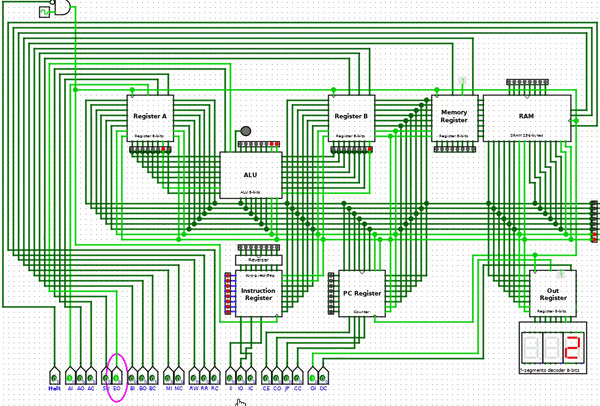
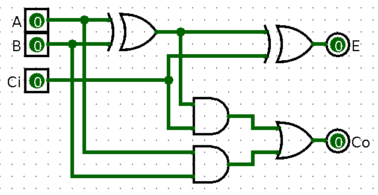
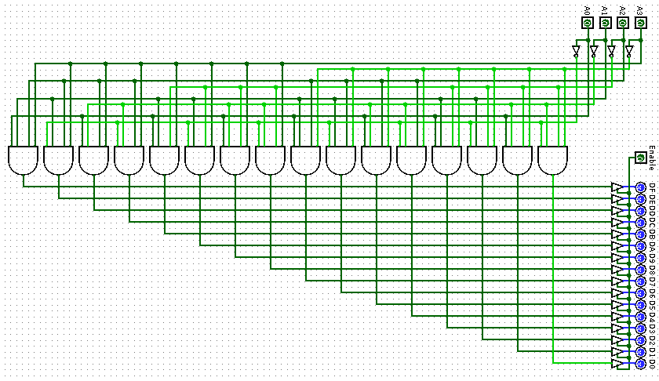

# Basic 8-bits computer simulation

A basic 8-bits computer created with [LogiSim](http://www.cburch.com/logisim/pt/index.html) digital circuit simulator :computer:.

- [Basic 8-bits computer simulation](#Basic-8-bits-computer-simulation)
  - [Project goal](#Project-goal)
  - [Acknowledgments](#Acknowledgments)
  - [The current processor version](#The-current-processor-version)
  - [The BUS](#The-BUS)
  - [The full adder](#The-full-adder)
  - [The 8-bits Arithmetic and Logic Unit (ALU)](#The-8-bits-Arithmetic-and-Logic-Unit-ALU)
  - [The 4-bits address decoder](#The-4-bits-address-decoder)
  - [The 8-bits registers](#The-8-bits-registers)
  - [The RAM](#The-RAM)
    - [The DRAM and SRAM](#The-DRAM-and-SRAM)
    - [The 16 bytes SRAM](#The-16-bytes-SRAM)
    - [The 256 bytes SRAM](#The-256-bytes-SRAM)
  - [The program counter (PC)](#The-program-counter-PC)
  - [The microcode / instruction set](#The-microcode--instruction-set)
  - [The 8-bits to 7-segments decoder](#The-8-bits-to-7-segments-decoder)
 
## Project goal

This project goal is to build a basic 8-bits computer with a functional 8-bits processor using a digital circuit simulator (LogiSim).

For future versions I will expand the circuits modules and functionalities creating a more complex processor, but for now, I'm trying to keep the circuits as simple as possible.

## Acknowledgments

`Ben Eater` and his [YouTube channel](https://www.youtube.com/user/eaterbc) with great videos explaining about a processor architecture.

## The current processor version

This is the current processor circuit version. It's not complete yet, but it's quite cool, isn't?.

Is there anything missing? Yes, I know, the ~~program counter (PC)~~, instructions decoder, the ~~RAM memory~~, etc. I'll put these modules into the processor in the next versions.

## The BUS

The BUS is used to connect all processor modules allowing the components to communicate with each other.

Normally there is more than 1 bus in a processor, like the data BUS, address BUS, control BUS, etc. For the first processor version I'm using only 2 BUS, one for data and one for control.

The data bus:

## The full adder

This is the circuit responsible for sum two numbers. It's a important ALU piece.

## The 8-bits Arithmetic and Logic Unit (ALU)

The ALU executes the arithmetic (sum, subtract, multiplication, division) and logic (and, or, xor, not, comparison) operations inside the processor. In my processor, the ALU is directly connected to the registers A and B to use them as source to perform the operations.

For this first processor version, I will only implement the sum and subtraction operations, reserving the other operations for a future version.

## The 4-bits address decoder

The address decoder is responsible for decode one binary address to a binary signal (1-bit). For each address the circuit will activated one different output.

This circuit decodes each of the 4-bits address to a different output signal in a total of 16 outputs. 

## The 8-bits registers

A register is a processor piece that is responsible for storing information. In our case, the 8-bits register will store an 8-bits number.

The register works using a D flip-flop for store a bit. Each 8-bits register uses 8 D flip-flop for store a byte (8-bits).

This processor will use 5 registers: 

1) Program counter register (PC)
2) Register A connected to the ALU
3) Register B connected to the ALU
4) Instruction register
5) Memory address register

The RAM memory used in this computer also uses the 8-bits registry.

This is the internal 8-bits register circuit:

## The RAM

The RAM (Random Access Memory) is responsible for store values with 8-bits each (word size). This values will include the program binary and the program variables.

### The DRAM and SRAM

There are different types of RAM. Dynamic RAM (DRAM) and Static RAM (SRAM) are usually found in our computers. 

DRAM is a memory based on capacitors, with less components compared with the SRAM memory, but with the necessity to refresh the capacitors many times per second for avoid data loss. 

SRAM is based on D flip-flop registers generating a more complex circuit to store a bit, but with no refresh circuits.

This project is using SRAM memory type for the RAM circuit.

### The 16 bytes SRAM

The 16 bytes SRAM uses 16 registers to store 1 byte each and a 4-bits length address to access the memory data.

### The 256 bytes SRAM

This computer uses a 256 bytes SRAM memory composed by 16 SRAM modules with 16 bytes each (16 x 16 bytes = 256 bytes).

The image bellow is the 256 bytes SRAM memory circuit. For only 256 bytes we have this crazy complexity, remembering that each one of the 16 SRAM shown in the circuit is a [16 bytes SRAM](#the-16-bytes-sram), imagine a 16GB RAM memory! Wow! :flushed:

## The program counter (PC)

The program counter is a special register responsible for storing the address of the next instruction that will be processed when the current instruction processing finishes. This circuit is basically a binary counter that allows not only increment the counter value, but also to change the current value for a new one. This capability is used to create jump instructions.

## The microcode / instruction set

The *instruction set* is the basic list of instructions provided by the processor telling it what it needs to execute.

I didn't finished yet the processor instruction set but you can follow the creation process through the spreadsheet [Instruction set](https://docs.google.com/spreadsheets/d/1Fneg8PanTtMlRC4RZEkOpCdoTKiEzFjZNxuiX3XXzDU/edit#gid=0).

## The 8-bits to 7-segments decoder

This circuit decodes a 8-bits number showing it in a base 10 number into a set of 3 7-segment displays.

The 7-segments display uses segments from A to B plus decimal point segment to represent a number.

There are a several ways to decode a number to show it into a 7-segment display. My approach was to use a ROM with the decoding codes. Using a 21-bits word (7-bits for which display) I constructed all decoding codes possibilities to show a number from 0 to 255 (8-bits).

I created the script [generate_8-bits_7-segments_hex_decoder.py](https://github.com/leonicolas/computer-8bits/blob/master/scripts/generate_8-bits_7-segments_hex_decoder.py) to help me generate the entire ROM content.

As an example, the code bellow decodes the number *123* from it 8-bits representation to the 7-segments format.

|   ROM address   | Hundreds Segment |   Tens Segment   |   Ones Segment   |    Hex   |
|:---------------:|:----------------:|:----------------:|:----------------:|:--------:|
|     Segments => |   g f e d c b a  |   g f e d c b a  |   g f e d c b a  |          |
| 123 = 0111 1011 |   0 0 0 0 1 1 0  |   1 0 1 1 0 1 1  |   1 0 0 1 1 1 1  | 0x01adcf |

