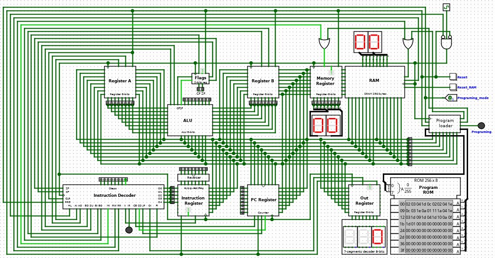
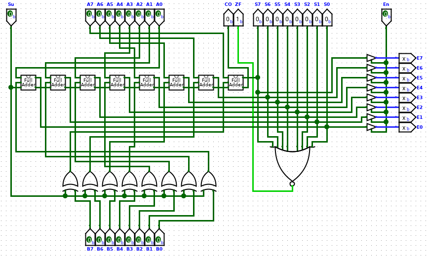
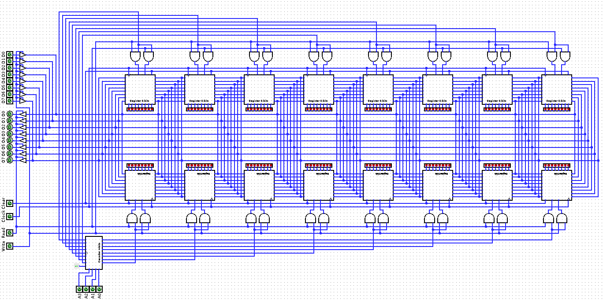
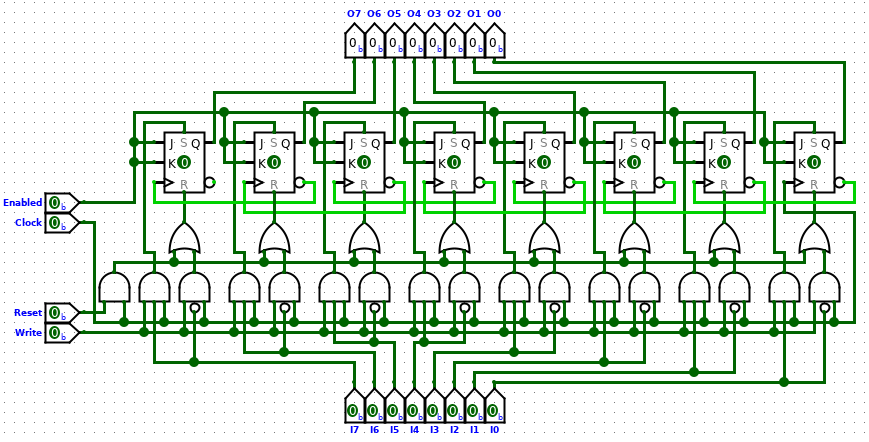
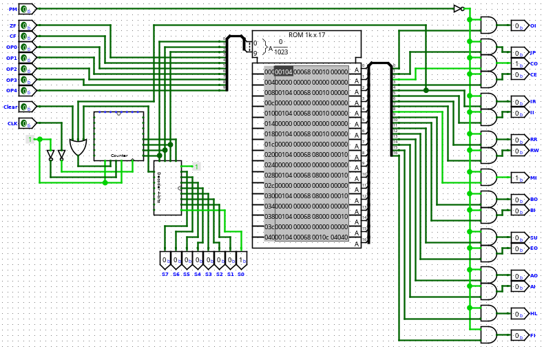

# Basic 8-bits computer simulation

A basic 8-bits computer created with [LogiSim](http://www.cburch.com/logisim/pt/index.html) digital circuit simulator :computer:.

- [Basic 8-bits computer simulation](#Basic-8-bits-computer-simulation)
  - [Project goal](#Project-goal)
  - [Acknowledgments](#Acknowledgments)
  - [The current processor version](#The-current-processor-version)
  - [The microcode / instruction set](#The-microcode--instruction-set)
  - [Instructions](#Instructions)
  - [Program examples](#Program-examples)
    - [How to load and run a program](#How-to-load-and-run-a-program)
    - [Multiplication](#Multiplication)
    - [Fibonacci](#Fibonacci)
  - [Circuits](#Circuits)
    - [The BUS](#The-BUS)
    - [The full adder](#The-full-adder)
    - [The 8-bits Arithmetic and Logic Unit (ALU)](#The-8-bits-Arithmetic-and-Logic-Unit-ALU)
    - [The 4-bits address decoder](#The-4-bits-address-decoder)
    - [The 8-bits registers](#The-8-bits-registers)
    - [The RAM](#The-RAM)
      - [The DRAM and SRAM](#The-DRAM-and-SRAM)
      - [The 16 bytes SRAM](#The-16-bytes-SRAM)
      - [The 256 bytes SRAM](#The-256-bytes-SRAM)
    - [The program counter (PC)](#The-program-counter-PC)
    - [The instruction decoder](#The-instruction-decoder)
    - [The 8-bits to 7-segments decoder](#The-8-bits-to-7-segments-decoder)

## Project goal

This project goal is to build a basic 8-bits computer with a functional 8-bits processor using a digital circuit simulator (LogiSim).

For future versions I will expand the circuits modules and functionalities creating a more complex processor, but for now, I'm trying to keep the circuits as simple as possible.

This processor project is not focused on performance, instead I prioritized the simplicity to create circuits easy to understand.

`Note`: There are two processor versions. The first one committed on the `master` branch that uses the DRAM memory created by me with registers and logic ports and the second one committed on the `logisim-native-ram` branch using the Logisim memory RAM component.

## Acknowledgments

`Ben Eater` and his [YouTube channel](https://www.youtube.com/user/eaterbc) with great videos explaining about a processor architecture.

## The current processor version

This is the current processor circuit version. It's not complete yet, but it's quite cool, isn't?.



Is there anything missing? Yes, I know, the ~~program counter (PC)~~, ~~instructions decoder~~, the ~~RAM memory~~, etc. I'll put these modules into the processor in the next versions.

## The microcode / instruction set

The *instruction set* is the basic list of instructions provided by the processor telling it what it needs to execute. This processor uses CISC (Complex Instruction Set Computers) instructions instead the more simple RISC (Reduced Instruction Set Computer) instructions.

The script [generate_cpu_microcode.py](scripts/generate_cpu_microcode.py) generates the ROM content to be load in the instruction decoder circuit.

## Instructions

| Instruction | OpCode | Description |
| ----------- |:------: | ---------------- |
| NOP         |  0x00  | No operation. Fetches the next operation. |
| HALT        |  0x01  | Stops the computer clock. |
| LDA NUM     |  0x02  | Loads register A with the given value. |
| LDA [ADDR]  |  0x03  | Loads register A with the value stored in the given memory address. |
| STA [ADDR]  |  0x04  | Stores the register A value in the given memory address. |
| LDB NUM     |  0x05  | Loads register B with the given value. |
| LDB [ADDR]  |  0x06  | Loads register B with the value stored in the given memory address. |
| STB [ADDR]  |  0x07  | Stores the register B value in the given memory address. |
| ADD NUM     |  0x08  | Adds the given value with the value stored in register A and stores the sum result in register A. The given number will be stored in register B. |
| ADD [ADDR]  |  0x09  | Adds the value stored in the given memory address with the value stored in register A. Stores the sum result in register A. |
| SUB NUM     |  0x0A  | Subtracts the given value with the value stored in register A and stores the subtraction result in register A. The given number will be stored in register B. |
| SUB [ADDR]  |  0x0B  | Subtracts the value stored in the given memory address with the value stored in register A. Stores the subtraction result in register A. |
| OUTA        |  0x0C  | Sets the Output register with the register A value. |
| OUTB        |  0x0D  | Sets the Output register with the register B value. |
| OUT NUM     |  0x0E  | Sets the Output register with the given value. |
| OUT [ADDR]  |  0x0F  | Sets the Output register with the value stored in the given memory address. |
| JP [ADDR]   |  0x10  | Jumps to the given address. |
| JPZ [ADDR]  |  0x11  | Jumps to the given address if the zero flag is 1. |
| JPC [ADDR]  |  0x12  | Jumps to the given address if the carry flag is 1. |

The spreadsheet [Instruction set](https://docs.google.com/spreadsheets/d/1Fneg8PanTtMlRC4RZEkOpCdoTKiEzFjZNxuiX3XXzDU/edit#gid=0) shows the instructions steps and control flags.

## Program examples

### How to load and run a program

`Create your program:`

1. Write a program using the processor instructions.
2. Convert it to binary and save it using the format like the [multiplication.bin](programs/multiplication.raw) file (I didn't finish the compiler development yet :grimacing:).
3. Open the processor_8-bits.circ using LogiSim Evolution simulator.

`Instructions for the master branch version:`

1. Click with the mouse right button on the Program ROM and click on Load image...
2. Choose you program raw file loading it in the Program ROM.
3. Click on the  button.
4. Enable the programming mode clicking on 
5. Using the `Simulate` menu start the clock selecting the `Ticks Enable` menu entry.
6. Wait until all your program code is loaded to the RAM. You can track the program loading through the gray box shown inside the Program ROM.
7. Disable the programming mode clicking on .
8. Click on the  button.
9. Now watch the magic happening :stuck_out_tongue_winking_eye:.

`Instructions for the logisim-native-ram branch version:`

1. Click with the mouse right button on the RAM and click on Load image...
2. Choose you program raw file loading it in the RAM.
3. Click on the  button.
4. Click on the  button.
5. Using the `Simulate` menu start the clock selecting the `Ticks Enable` menu entry.
6. Now watch the magic happening :stuck_out_tongue_winking_eye:.

### Multiplication

```nasm
INITIALIZATION:
0x00  LDA 4             # Initializes the factor loading it in register A.
0x02  STA [FACTOR]      # Stores register A in the factor memory address.
0x04  OUTA              # Output the factor.

0x05  LDA 0             # Initializes the result loading it in register A.
0x07  STA [RESULT]      # Stores register A in the result memory address.

0x09  LDA 3             # Initializes the multiplicand loading it in register A.
0x0B  STA [MULT]        # Stores register A in the multiplicand memory address.
0x0D  OUTA              # Output the multiplicand.

START:                  # 0x0E
0x0E  JPZ [END]         # If multiplicand equals zero goes to the end.

0x10  LDA [RESULT]      # Loads the factor in register A.
0x12  ADD [FACTOR]      # Adds the factor.
0x14  STA [RESULT]      # Stores the result of adition in result.

0x16  LDA [MULT]        # Loads the multiplicand in register A.
0x18  SUB 1             # Decrement the multiplicand.
0x1C  STA [MULT]        # Stores the multiplicand.

0x1E  JP  [START]       # Jumps to start.

END:                    # 0x20
0x20  OUT [RESULT]      # Output the result.
0x22  HALT              # Halts the program.

# VARIABLES:
# 0x23  FACTOR
# 0x24  MULT
# 0X25  RESULT
```

Binary representation:

[multiplication.raw](programs/multiplication.raw)

### Fibonacci

```nasm
INIT:                   # 0x00
0x00  LDA 0             # Initializes the number 1 loading it in register A.
0x02  STA [NUM1]        # Stores register A in the number 1 memory address.
0x04  OUT [NUM1]        # Output the number 1.

0x06  LDA 1             # Initializes the number 2 loading it in register A.
0x08  STA [NUM2]        # Stores register A in the number 2 memory address.

START:                  # 0x0A
0x0A  OUT [NUM2]        # Output the number 2.
0x0C  LDA [NUM1]        # Loads the number 1 in register A.
0x0E  ADD [NUM2]        # Adds the number 2.
0x10  STB [NUM1]        # Stores number 2 in number 1.
0x12  STA [NUM2]        # Stores the sum of number 1 and 2 in number 2.

0x14  JPC [INIT]        # Jump on carry (restart).
0x16  JP  [START]       # Jumps to start.

# VARIABLES:
# 0x18  NUM1
# 0x19  NUM2
```

Binary representation:

[fibonacci.raw](programs/fibonacci.raw)


## Circuits

### The BUS

The BUS is used to connect all processor modules allowing the components to communicate with each other.

Normally there is more than 1 bus in a processor, like the data BUS, address BUS, control BUS, etc. For the first processor version I'm using only 2 BUS, one for data and one for control.

The data bus:


### The full adder

This is the circuit responsible for sum two numbers. It's a important ALU piece.


### The 8-bits Arithmetic and Logic Unit (ALU)

The ALU executes the arithmetic (sum, subtract, multiplication, division) and logic (and, or, xor, not, comparison) operations inside the processor. In my processor, the ALU is directly connected to the registers A and B to use them as source to perform the operations.

For this first processor version, I will only implement the sum and subtraction operations, reserving the other operations for a future version.



### The 4-bits address decoder

The address decoder is responsible for decode one binary address to a binary signal (1-bit). For each address the circuit will activated one different output.

This circuit decodes each of the 4-bits address to a different output signal in a total of 16 outputs.


### The 8-bits registers

A register is a processor piece that is responsible for storing information. In our case, the 8-bits register will store an 8-bits number.

The register works using a D flip-flop for store a bit. Each 8-bits register uses 8 D flip-flop for store a byte (8-bits).

This processor will use 6 registers:

1) Program counter register (PC)
2) Register A connected to the ALU
3) Register B connected to the ALU
4) Instruction register
5) Memory address register
6) Output register

The RAM memory used in this computer also uses the 8-bits registry.

This is the internal 8-bits register circuit:


### The RAM

The RAM (Random Access Memory) is responsible for store values with 8-bits each (word size). This values will include the program binary and the program variables.

#### The DRAM and SRAM

There are different types of RAM. Dynamic RAM (DRAM) and Static RAM (SRAM) are usually found in our computers.

DRAM is a memory based on capacitors, with less components compared with the SRAM memory, but with the necessity to refresh the capacitors many times per second for avoid data loss.

SRAM is based on D flip-flop registers generating a more complex circuit to store a bit, but with no refresh circuits.

This project is using SRAM memory type for the RAM circuit.

#### The 16 bytes SRAM

The 16 bytes SRAM uses 16 registers to store 1 byte each and a 4-bits length address to access the memory data.



#### The 256 bytes SRAM

This computer uses a 256 bytes SRAM memory composed by 16 SRAM modules with 16 bytes each (16 x 16 bytes = 256 bytes).

The image below is the 256 bytes SRAM memory circuit. For only 256 bytes we have this crazy complexity, remembering that each one of the 16 SRAM shown in the circuit is a [16 bytes SRAM](#the-16-bytes-sram), imagine a 16GB RAM memory! Wow! :flushed:


### The program counter (PC)

The program counter is a special register responsible for storing the address of the next instruction that will be processed when the current instruction processing finishes. This circuit is basically a binary counter that allows not only increment the counter value, but also to change the current value for a new one. This capability is used to create jump instructions.



### The instruction decoder

This circuit is responsible for fetching instructions from the RAM, decoding it and changing the control flags in order for the processor to execute the instructions. The [Instruction set](#The-microcode--instruction-set) describes all instructions the decoder knows and which flags are enabled for each step during the instruction execution.

This is the microcode used to decode the instructions: [cpu_microcode.rom](roms/cpu_microcode.rom)

The microcode is generated by [generate_cpu_microcode.py](scripts/generate_cpu_microcode.py) script.



### The 8-bits to 7-segments decoder

This circuit decodes a 8-bits number showing it in a base 10 number into a set of 3 7-segment displays.

The 7-segments display uses segments from A to G plus decimal point segment to represent a number.


There are several ways to decode a number to show it into a 7-segment display. My approach was to use a ROM with the decoding codes. Using a 21-bits word (7-bits for which display) I constructed all decoding codes possibilities to show a number from 0 to 255 (8-bits).

I created the script [generate_8-bits_7-segments_hex_decoder.py](https://github.com/leonicolas/computer-8bits/blob/master/scripts/generate_8-bits_7-segments_hex_decoder.py) to help me generate the entire ROM content.

As an example, the code below decodes the number *123* from it 8-bits representation to the 7-segments format.

|   ROM address   | Hundreds Segment |   Tens Segment   |   Ones Segment   |    Hex   |
|:---------------:|:----------------:|:----------------:|:----------------:|:--------:|
|     Segments => |   g f e d c b a  |   g f e d c b a  |   g f e d c b a  |          |
| 123 = 0111 1011 |   0 0 0 0 1 1 0  |   1 0 1 1 0 1 1  |   1 0 0 1 1 1 1  | 0x01adcf |
